# Práctica 4.1: Configuración de un servidor DNS

## Introducción

En esta práctica se llevará a cabo la instalación y configuración del servidor de nombres bind9.

Este tipo de servidores se encargan de resolver los nombres de dominio de las URL, actuando como un intermediario esencial. Su función es clave, ya que permite que las direcciones URL sean más fáciles de recordar, en lugar de utilizar direcciones numéricas complejas para identificar una máquina.

## Instalación de Bind9:

Nos conectamos mediante `SSH` a nuestro servidor usando el siguiente comando: 

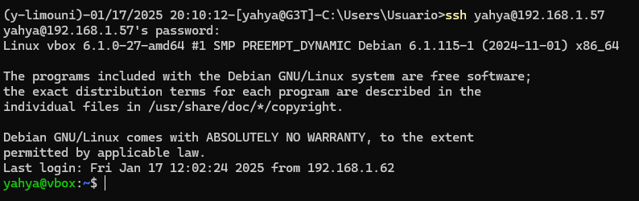

Primero actualizamos los paquetes de Debian:

```bash
    sudo apt update 
    sudo apt upgrade
```

Para instalar Bind9 en Debian 12, utilizaremos el gestor de 
paquetes del sistema, ya que está disponible en los repositorios. El comando que debemos ejecutar es el siguiente:

```bash
    sudo apt-get install bind9 bind9utils bind9-doc
```
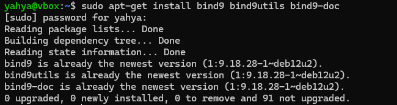

Dado que en esta práctica y para el servidor de pruebas no vamos a necesitar IPV6, podemos desactivarla modificando los parámetros de inicio del servicio named, que es el nombre del servidor Bind9.

Para ello, debemos editar el archivo /etc/default/named y agregar el parámetro -4 al final de la variable OPTIONS, tal como se muestra en la captura.

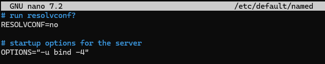

## Archivo de configuración principal

Este archivo se encarga de agrupar los tres archivos de configuración principales del servidor Bind9. Generalmente, no es necesario modificarlo, ya que su función es incluir los diferentes archivos de configuración, los cuales son:

* **named.conf.options**: Contiene las opciones generales del servidor Bind9.
* **named.conf.local**: Define las zonas del servidor Bind9.
* **named.conf.default-zones**: Contiene las zonas predeterminadas del servidor Bind9, como la de localhost y la de broadcast. Este archivo no será modificado en esta práctica.

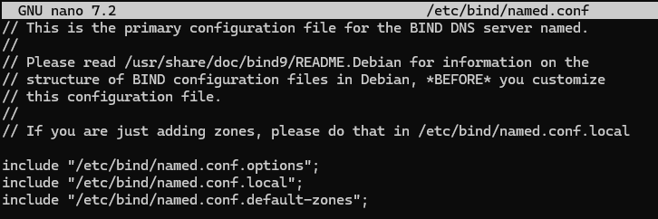

## Configuración general

Antes de definir las zonas, es necesario hacer algunos cambios en el archivo de configuración general.

## Copia de seguridad

Siempre que se modifican archivos de configuración, es recomendable guardar una copia de seguridad de la versión que funciona, por si necesitamos volver a ella. Esto se puede hacer con el siguiente comando:

```bash
sudo cp /etc/bind/named.conf.options /etc/bind/named.conf.options.backup
```

##Lista blanca de peticiones

En esta práctica, vamos a crear una lista blanca para permitir que solo ciertas redes puedan hacer consultas al servidor de nombres. Esto se hace usando el bloque acl, donde agregamos las direcciones de red permitidas junto con su máscara de red abreviada. El formato del bloque es el siguiente:

```bash
acl "<nombreAcl>" {
    <byte>.<byte>.<byte>.<byte>/<máscara>;
    //...
};
```

En mi caso, lo he denominado *trusted*:

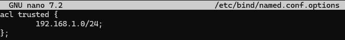

## Configuración del servidor

La configuración que vamos a hacer es la siguiente:

1. Primero, desactivamos las peticiones con IPV6. Aunque ya lo habíamos hecho antes, también lo tenemos que configurar aquí.
2. Decimos que solo las redes de la lista blanca podrán hacer consultas recursivas a otros DNS para resolver nombres. Aún no les damos permiso para hacer estas consultas, solo indicamos quiénes pueden hacerlo.
3. Configuramos el servidor para que ningún equipo que haga una petición a nuestro DNS pueda ser redirigido a otra zona diferente de la que está usando.
4. Establecemos que el servidor Bind9 escuche en la IP y el puerto que hemos indicado.
5. Permitimos las consultas recursivas en Bind9.

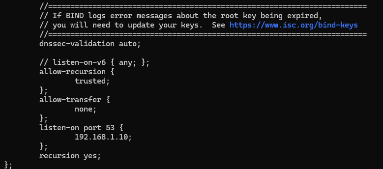


Verificamos que toda la configuración esté correcta con el siguiente comando:

```bash
    sudo named-checkconf
```

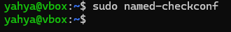


## Zona DNS principal
Para definir las zonas nos dirigimos al archivo named.conf.local, y en dicho archivo debemos de usar el bloque zone{...}; para definir las diferentes zonas. La sintáxis es la siguiente:

```bash
zone "<nombre_zona>" {
    type master;
    file "<ruta_archivo_zona>";
}
```


## Archivo de zona 

Añadimos los registros correspondientes SOA, NS y un nuevo registro de tipo A. Este último indica que el subdominio "debian" se asociará con la IP que especifiquemos, y su sintaxis será de la siguiente forma: `<subdominio> IN A <ip>`.

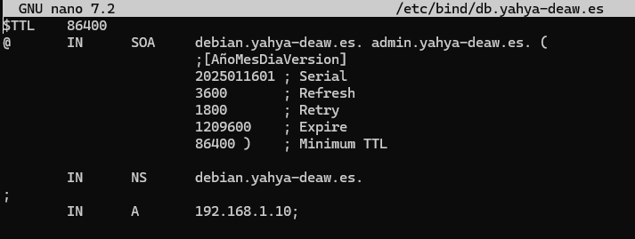

## Zona DNS inversa

Para configurar la zona inversa, debemos usar una sintaxis especial que le indique al servidor DNS que esa zona se utilizará para resolver direcciones IP a nombres de dominio.

El nombre de la zona será `<dirección de red inversa sin los octetos de host>.in-addr.arpa`. Aparte de esto, el proceso es igual al de crear una zona normal.

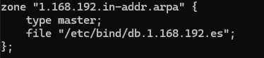

## Archivo de zona inversa

Añadimos los registros correspondientes SOA, NS y un nuevo registro de tipo PTR.

El registro PTR es el opuesto al registro A, ya que en lugar de vincular un nombre de dominio a una dirección IP, asocia una dirección IP con un nombre de dominio. La diferencia principal es que la dirección IP se invierte. Por ejemplo, si la IP es 192.168.1.10, en el registro PTR se escribe como 10.1.168.192. Además, como la zona se llama 1.168.192.in-addr.arpa (en mi caso), solo necesitamos colocar la parte de la dirección que corresponde al host, es decir, 10, sin tener que escribir toda la IP completa.


## Comprobación del funcionamiento del DNS

Comprobamos configuración

Para comprobar que todo funciona correctamente tenemos que ejecutar los dos siguientes comandos, fijándonos si en las salidas de estos nos devuelven un OK.

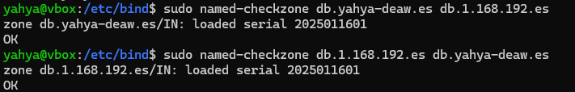

Una vez tenemos OK en las dos zonas, podemos reiniciar el servicio de Bind9 para aplicar los cambios, esto se hace con el siguiente comando:

```bash
    sudo systemctl restart named
```

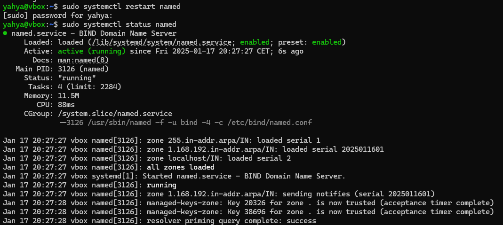

## Comprobamos las resoluciones de nombre con dig
Para comprobar que todo funciona correctamente primeramente debemos de configurar nuestro sistema para añadir el servidor DNS para que pregunte a este además del por defecto, en mi caso con Debian sería en la configuración de la red conectada.

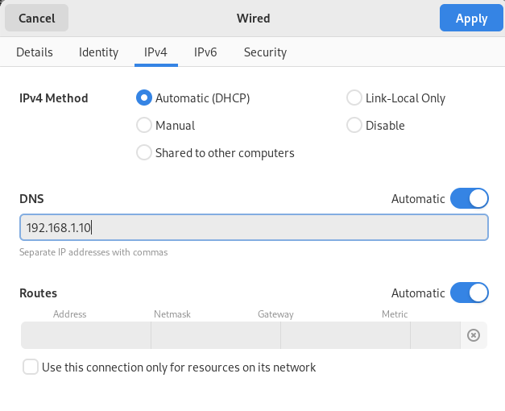

Ahora para ver si nos resuelve correctamente el nombre, debemos de usar el comando:

```bash
    dig <subdominio o dominio>
```

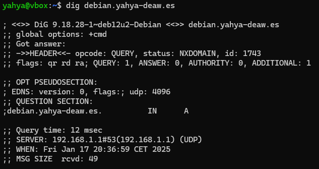

Ahora para ver si nos resuelve correctamente el nombre, debemos de usar el comando:

```bash
 dig -x <ip>
```

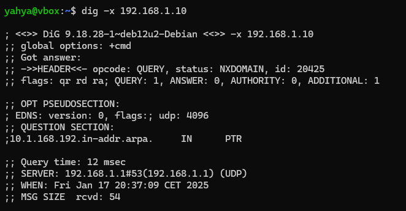


## Cuestiones

### Cuestión 1:
*¿Qué pasará si un cliente de una red diferente a la tuya intenta hacer uso de tu DNS de alguna manera, le funcionará?¿Por qué, en qué parte de la configuración puede verse?*

Si un cliente de una red diferente intenta usar el DNS de otra red, normalmente no funcionará. Esto ocurre porque el servidor DNS esta configurado para responder solo a las peticiones que vienen de su propia red.

### Cuestión 2:
*¿Por qué tenemos que permitir las consultas recursivas en la configuración?*

Las consultas recursivas se permiten en la configuración de un servidor DNS porque simplifican y optimizan el proceso de resolución de nombres para los clientes. 

### Cuestión 3:
*El servidor DNS que acabáis de montar, ¿es autoritativo? ¿Por qué?*

El servidor DNS que se ha montado puede considerarse autoritativo porque actúa como la fuente definitiva de información para los dominios que gestiona.

### Cuestión 4:
*¿Dónde podemos encontrar la directiva $ORIGIN y para qué sirve?*

La directiva $ORIGIN se encuentra en los ficheros de zona DNS y sirve para definir el dominio base que se añadirá automáticamente a los nombres incompletos en los registros de recursos.

### Cuestión 5:
*¿Una zona es idéntico a un dominio?*

Un dominio es un nombre completo en la jerarquía DNS, como "daw.com", mientras que una zona es una porción del espacio de nombres DNS que está bajo el control administrativo de una entidad específica

### Cuestión 6:
*¿Pueden editarse los archivos de zona de un servidor esclavo/secundario?*

Los archivos de zona de un servidor DNS esclavo o secundario no pueden editarse directamente. Estos archivos se generan automáticamente mediante transferencias de zona desde el servidor primario y son de solo lectura en el servidor secundario.

### Cuestión 7:
*¿Por qué podría querer tener más de un servidor esclavo para una misma zona?*

Tener múltiples servidores esclavos para una misma zona DNS es una estrategia crucial para garantizar la disponibilidad continua del servicio DNS. Si por ejemplo falla un servidor, los otros servidores seguiran respondiendo a las consultas.

### Cuestión 8:
*¿Cuántos servidores raíz existen?*

Existen 13 identificadores de servidores raíz (RSI) en el sistema DNS, pero el número real de servidores físicos es mucho mayor

### Cuestión 9:

¿Qué es una consulta iterativa de referencia?

### Cuestión 10: 
Al que le indiquemos en el registro PTR de la zona DNS inversa.